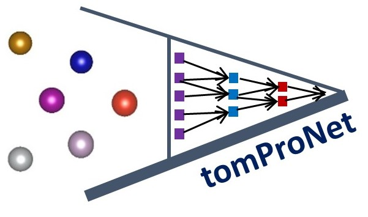

<!----->
<!---](https://doi.org/your-paper-doi)-->
[](https://www.python.org/downloads/)
[](https://github.com/MusannaGalib/AtomProNet)
[](https://opensource.org/licenses/MIT)

# AtomProNet: Atomic Data Processing for Neural Network
<div align="center">
  
</div>


This package demonstrates a data processing workflow involving Bash script, Python conversion scripts, which automatically converts multiple VASP OUTCAR data into neural network training format (extxyz or npz).

```
AtomProNet
    |
    ├── Data collection from materials project database
    │   │
    │   ├── Atomic energy, position, lattice parameters                   
    │   └── Supercell formation  
    |
    |
    ├── Data generation using DFT simulation (VASP/Quantum Espresso)
    │   │
    │   ├── Batch job preparation  
    │   ├── Batch job submission                   
    │   └── Batch data collection            
    │
    │
    ├── Pre-processing for Neural Network  (Post-processing of DFT simulation)             
    │   │
    │   └── DFT folders 
    │       │       
    │       ├── energy
    │       ├── forces
    │       ├── pressure      
    │       └── lattice parameters            
    │            │
    │            └── extxyz/npz format
    │
    │
    └── Post-processing
        ├── Machine Learning Interatomic Potential (MLIP)         
        │   │                 
        │   ├── Parity plots
        │   └── Cumulative distributions
        │
        └── Classical Molecular Dynamics (LAMMPS) 
            │   
            ├── Validations
            └── Visualization   

```

## Tutorial

Example notebook of using AtomProNet's 4 modules- <a href="https://colab.research.google.com/drive/1RZ4txh0NH7t5kEyNNxojxVN8c5QAky5P?usp=sharing" target="_blank"> </a>


## Installation and Usage Guide

This guide provides detailed instructions on how to install and use the AtomProNet package.

### Prerequisites
- Python 3.6 or later
- Pip (Python package manager)

### Installation
1. **Download the Package:**
   - Download the zip file containing the AtomProNet package.
   - Extract the zip file to a directory of your choice.

2. **Install the Package:**
   - Open a command prompt or terminal.
   - Navigate to the directory where you extracted the package.
   - Install the package by running the command:
     ```
     git clone https://github.com/MusannaGalib/AtomProNet.git
     cd AtomProNet
     pip install .
     ```
   This command installs the package along with its dependencies.

   AtomProNet can also be installed from PyPI:
     ```
     pip install AtomProNet
     ```

## Using the Package

### Example Usage

Example datasets are given in 'example_dataset' folder. You can use the following commands to play with that by executing the python wrapper file.

```python
python3 process_and_run_script.py
```

## Workflow Overview

1. **Bash Scripts (`.sh` files):**
   - Takes a user-provided file path, process VASP and Quantum ESPRESSO job submission
   - Takes a user-provided file path, runs over all VASP and Quantum ESPRESSO simulation folders
   - Collect all the required information (energy, force, atomic positions, pressure in eV, lattice parameters)

2. **Python Converter (`lattice.py, energy.py, position_force.py, atom_symbol.py, pressure_eV.py, combine.py, npz_to_extxyz.py, MLIP_post_processing.py`):**
   - Processes the files generated by the Bash script.
   - Outputs the converted npz and extxyz files.
   - Post-process MLIP data to get parity plots and cumulative distributions.


**Options**

To use this package, use the following options:

```python
Choose an option:
1. Data from Materials Project
2. Pre-processing for DFT simulation
3. Pre-processing for Neural Network
4. Post-processing
```
```python
Enter your choice (1/2/3/4 or 'exit'): 1
Enter your Materials Project API key (press Enter to use default): 
Enter the material ID (e.g., mp-1234), compound formula (e.g., Al2O3), or elements (e.g., Li, O, Mn): Al2O3
Do you want to create supercells for all structures? (yes/no): yes
Enter the supercell size (e.g., 2 2 2): 2 3 4
Do you want to download energy+lattice data for the materials? (yes/no): yes
```

```python
Enter your choice (1/2/3/4 or 'exit'): 2
Options:
1: VASP
        Enter your choice: 1
        VASP Options:
        1: Prepare VASP job submission folders
        2: VASP job submission
        3: Post-processing of VASP jobs       
        q: Quit
2: Quantum ESPRESSO
        Enter your choice: 2
        Quantum ESPRESSO Options:
        1: Prepare Quantum ESPRESSO job submission folders
        2: Quantum ESPRESSO job submission
        3: Post-processing of Quantum ESPRESSO jobs
        q: Quit
q: Quit
```
1. **Instruction for preparing VASP jobs: (`"INCAR", "KPOINTS", "vasp_jobsub.sh"`):**
   - `"INCAR", "KPOINTS", "vasp_jobsub.sh"` files must be outside of the folder containing all the `POSCAR` files
   - `POTCAR` files must be provided as `POTCAR_$atomsymbol` (e.g. `POTCAR_Al`, `POTCAR_O`)

1. **Instruction for preparing Quantum ESPRESSO jobs: (`"INCAR", "KPOINTS", "vasp_jobsub.sh"`):**
   - The code will prepare `input_template` and `qe_jobsub.sh` one level up of the provided `POSCAR` files
   - Update the `input_template` and `qe_jobsub.sh` as needed 
   - Pesudopotentials files must be provided as `$atomsymbol_*.UPF` (e.g. `li_pbe_v1.4.uspp.F.UPF`, `O.pbe-n-kjpaw_psl.0.1.UPF`)


```python
Enter your choice (1/2/3/4 or 'exit'): 3
Do you want to run the first step (execute post-processing script)? (yes/no): yes
        Select the system for post-processing:
        1. VASP
              Enter your choice (1/2): 1
                Select the extraction type for VASP:
                1. Extract ionic last step (Self-Consistent simulations)
                   Do you want to split the Data files? (yes/no):
                2. Extract all ionic steps (Ab-initio MD)
                   Do you want to split the Data files? (yes/no):
        2. Quantum ESPRESSO
           Do you want to split the Data files? (yes/no): 
Do you want to split the dataset into train, test, and validation sets? (yes/no): yes
```

```python
Enter your choice (1/2/3/4 or 'exit'): 4
Post-Processing Options:
1. Post-Processing of MLIP
2. Post-Processing of LAMMPS
```


<details>
<summary>📖 Read More</summary>  

<br> 

**Pre-processing for DFT simulation (VASP)**

To use this package, run the Bash script with an input file, then pass the output file path to the Python scripts:

```bash
# Go to scripts folder change the following line according to your simulation range  ---> 
    Pre-processing for DFT simulation
    └── hydrostatic_strain.sh
        └── hydrostatic_strain_submission.sh (Limit 999 job submission; change it based on server)
            └── hydrostatic_strain_job_resubmission.sh

for EXX in $(seq -0.003 0.001 0.003); do
```

**Pre-processing for Neural Network  (Post-processing of DFT simulation)**

Run the process_and_run_script.py script using any code runner
```bash
python3 process_and_run_script.py
```

```bash
# Go to scripts folder change the following line according to your simulation range  ---> 
    Pre-processing for Neural Network
    └── hydrostatic_strain_post_processing.sh
        └── 2D/3D strain
            └── Atom types
```


 

**Additional Information**

Go to atom_symbol.py and change the atom types based on your DFT datafiles (CONTCAR)

```python
    # Create the array with atomic numbers
    Al_count = 8  #Al
    O_count = 12   #O

    # Create an array with 'Al' symbols followed by other elements
    atom_array = np.concatenate([np.full(Al_count, 'Al'), np.full(O_count, 'O')])

```

Options in lattice.py for 2D and 3D strains: (mianly required for data-extrantion from lattice.py)

```python
# change the index_line in 'lattice.py': 2 for inplane/2D strains; 3 for hydrostratic/3D strains
# Defalut: if len(index_line) == 3 (hydrostatic strain)
        if len(index_line) == 3:              #3 for -0.05 -0.05 -0.05   2 for -0.05 -0.05
```


**Ab-inito MD simulation:**
```bash
# in the main run file activate the bash file for AIMD data processing as following- AIMD_data_extract.sh 
    bash_script_path = os.path.join(script_dir, '..', 'scripts', 'AIMD_data_extract.sh')  
    subprocess.run(['bash', 'AIMD_data_extract.sh'], capture_output=True, text=True, check=True)
# give your folder path containing AIMD VASP data    
    process_and_run_script(r'F:\Research\ML\package\AtomProNet\example_dataset\AIMD')
```
```bash
# in AIMD_data_extract.sh file edit the following

#If you have multiple folder edit here to give ("alumina_*") the prefix of folders 
    for DIRECTORY in $(find . -type d -name "alumina_*"); do

# change this lopp (i<=10) depending on AIMD steps
		for ((i=1; i<=10; i++)); do   
			echo "0.0 0.0 0.0" >> ../lattice.txt
			sed -n '3,5p' CONTCAR | awk '{printf $1" "$2" "$3" "$4" "$5" "$6" "$7" "$8" "$9" "} END {print ""}' >> ../lattice.txt
		done
```
</details>

## Authors
This Software is developed by Musanna Galib


## Citing This Work
If you use this software in your research, please cite the following paper:


```python
BibTeX entry:
@article{YourPaper,
  title={Data flow to and from machine learning interatomic potentials in materials science},
  author={Musanna Galib, Mewael Isiet, Mauricio Ponga},
  journal={Journal/Conference},
  year={2025},
  publisher={Publisher}
}
```

### Contact, questions, and contributing
If you have questions, please don't hesitate to reach out to galibubc[at]student[dot]ubc[dot]ca

If you find a bug or have a proposal for a feature, please post it in the Issues. If you have a question, topic, or issue that isn't obviously one of those, try our GitHub Disucssions.

If your post is related to the framework/package, please post in the issues/discussion on that repository. 

